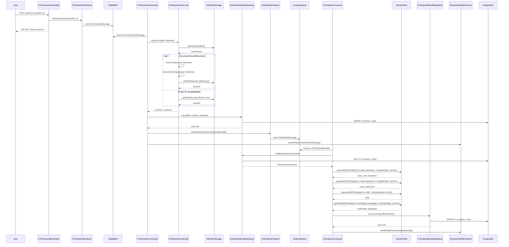

```mermaid
sequenceDiagram
    participant User
    participant CVProcessingController
    participant CVExtractionProducer
    participant RabbitMQ
    participant CVExtractionConsumer
    participant CVExtractionUseCase
    participant MinioFileStorage
    participant ExtractionResultRepository
    participant CVAnalysisProducer
    participant AnalysisQueue
    participant CVAnalysisConsumer
    participant GeminiClient
    participant CVAnalysisResultRepository
    participant ExtractionNotifyProducer
    participant PostgreSQL

    %% == Extract CV ==
    User->>CVProcessingController: POST /api/cv/extract/{file_id}
    CVProcessingController->>CVExtractionProducer: publishExtractionTask(file_id)
    CVExtractionProducer->>RabbitMQ: send CVExtractionMessage
    CVProcessingController-->>User: 200 OK ("Task accepted")

    CVExtractionConsumer->>RabbitMQ: consume CVExtractionMessage
    CVExtractionConsumer->>CVExtractionUseCase: extractCV(fileId, fileName)
    CVExtractionUseCase->>MinioFileStorage: downloadFile(fileId)
    MinioFileStorage-->>CVExtractionUseCase: InputStream

    alt Document file (pdf/doc/docx)
        CVExtractionUseCase->>CVExtractionUseCase: extractText(stream, fileName)
        CVExtractionUseCase->>CVExtractionUseCase: extractFirstImage(stream, fileName)
        CVExtractionUseCase->>MinioFileStorage: uploadFile(avatar-{fileId}.png)
        MinioFileStorage-->>CVExtractionUseCase: avatarId
    else Image file (png/jpg/jpeg)
        CVExtractionUseCase->>MinioFileStorage: uploadFile(avatar-{fileId}.<ext>)
        MinioFileStorage-->>CVExtractionUseCase: avatarId
    end

    CVExtractionUseCase-->>CVExtractionConsumer: { rawText, avatarId }
    CVExtractionConsumer->>ExtractionResultRepository: save(fileId, rawText, avatarId)
    ExtractionResultRepository->>PostgreSQL: INSERT extraction_result
    ExtractionResultRepository-->>CVExtractionConsumer: entity (id)
    CVExtractionConsumer->>CVAnalysisProducer: sendAnalysisTask(CVAnalysisMessage)
    CVAnalysisProducer->>AnalysisQueue: send CVAnalysisMessage
    CVExtractionConsumer->>ExtractionNotifyProducer: sendNotify(ExtractionNotifyMessage)

    %% == Analyze CV ==
    CVAnalysisConsumer->>AnalysisQueue: consume CVAnalysisMessage
    CVAnalysisConsumer->>ExtractionResultRepository: findById(extractionResultId)
    ExtractionResultRepository->>PostgreSQL: SELECT extraction_result
    ExtractionResultRepository-->>CVAnalysisConsumer: ExtractionResultEntity

    CVAnalysisConsumer->>GeminiClient: generateWithTemplate("cv-basic-education", templateData, rawText)
    GeminiClient-->>CVAnalysisConsumer: basic_info, education

    CVAnalysisConsumer->>GeminiClient: generateWithTemplate("cv-work-experience", templateData, rawText)
    GeminiClient-->>CVAnalysisConsumer: work_experience

    CVAnalysisConsumer->>GeminiClient: generateWithTemplate("cv-skills", templateData, rawText)
    GeminiClient-->>CVAnalysisConsumer: skills

    CVAnalysisConsumer->>GeminiClient: generateWithTemplate("cv-certificates-languages", templateData, rawText)
    GeminiClient-->>CVAnalysisConsumer: certificates, languages

    CVAnalysisConsumer->>CVAnalysisResultRepository: save(CVAnalysisResultEntity)
    CVAnalysisResultRepository->>PostgreSQL: INSERT cv_analysis_result
    CVAnalysisResultRepository-->>CVAnalysisConsumer: entity (id)
    CVAnalysisConsumer->>ExtractionNotifyProducer: sendNotify(ExtractionNotifyMessage)
```