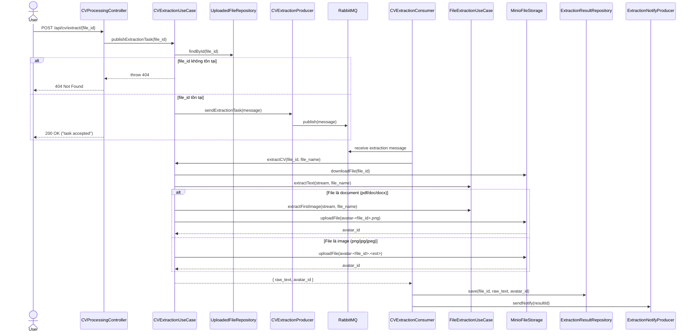

```mermaid
sequenceDiagram
    actor User
    participant CVProcessingController
    participant CVExtractionUseCase
    participant UploadedFileRepository
    participant CVExtractionProducer
    participant RabbitMQ
    participant CVExtractionConsumer
    participant FileExtractionUseCase
    participant MinioFileStorage
    participant ExtractionResultRepository
    participant ExtractionNotifyProducer

    User->>CVProcessingController: POST /api/cv/extract/{file_id}
    CVProcessingController->>CVExtractionUseCase: publishExtractionTask(file_id)
    CVExtractionUseCase->>UploadedFileRepository: findById(file_id)
    alt file_id không tồn tại
        CVExtractionUseCase-->>CVProcessingController: throw 404
        CVProcessingController-->>User: 404 Not Found
    else file_id tồn tại
        CVExtractionUseCase->>CVExtractionProducer: sendExtractionTask(message)
        CVExtractionProducer->>RabbitMQ: publish(message)
        CVProcessingController-->>User: 200 OK ("task accepted")
    end

    CVExtractionConsumer->>RabbitMQ: receive extraction message
    CVExtractionConsumer->>CVExtractionUseCase: extractCV(file_id, file_name)
    CVExtractionUseCase->>MinioFileStorage: downloadFile(file_id)
    CVExtractionUseCase->>FileExtractionUseCase: extractText(stream, file_name)
    alt File là document (pdf/doc/docx)
        CVExtractionUseCase->>FileExtractionUseCase: extractFirstImage(stream, file_name)
        CVExtractionUseCase->>MinioFileStorage: uploadFile(avatar-<file_id>.png)
        MinioFileStorage-->>CVExtractionUseCase: avatar_id
    else File là image (png/jpg/jpeg)
        CVExtractionUseCase->>MinioFileStorage: uploadFile(avatar-<file_id>.<ext>)
        MinioFileStorage-->>CVExtractionUseCase: avatar_id
    end
    CVExtractionUseCase-->>CVExtractionConsumer: { raw_text, avatar_id }
    CVExtractionConsumer->>ExtractionResultRepository: save(file_id, raw_text, avatar_id)
    CVExtractionConsumer->>ExtractionNotifyProducer: sendNotify(resultId)
```
