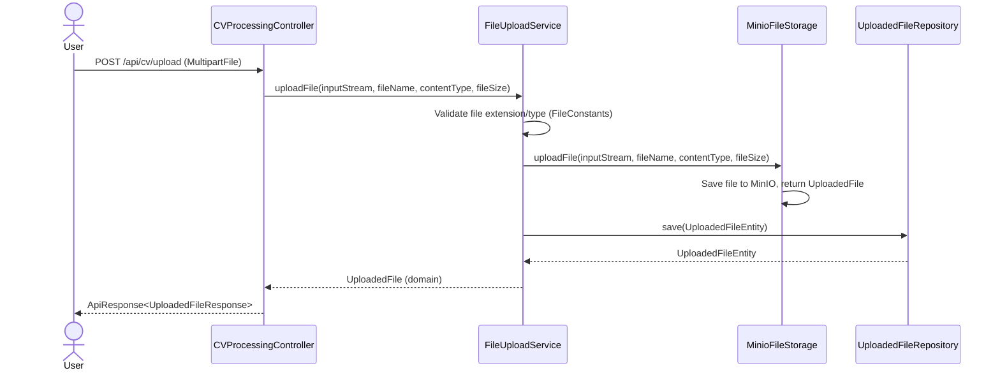

```mermaid
sequenceDiagram
    actor User
    participant CVProcessingController
    participant FileUploadService
    participant MinioFileStorage
    participant UploadedFileRepository

    User->>CVProcessingController: POST /api/cv/upload (MultipartFile)
    CVProcessingController->>FileUploadService: uploadFile(inputStream, fileName, contentType, fileSize)
    FileUploadService->>FileUploadService: Validate file extension/type (FileConstants)
    FileUploadService->>MinioFileStorage: uploadFile(inputStream, fileName, contentType, fileSize)
    MinioFileStorage->>MinioFileStorage: Save file to MinIO, return UploadedFile
    FileUploadService->>UploadedFileRepository: save(UploadedFileEntity)
    UploadedFileRepository-->>FileUploadService: UploadedFileEntity
    FileUploadService-->>CVProcessingController: UploadedFile (domain)
    CVProcessingController-->>User: ApiResponse<UploadedFileResponse>
```
