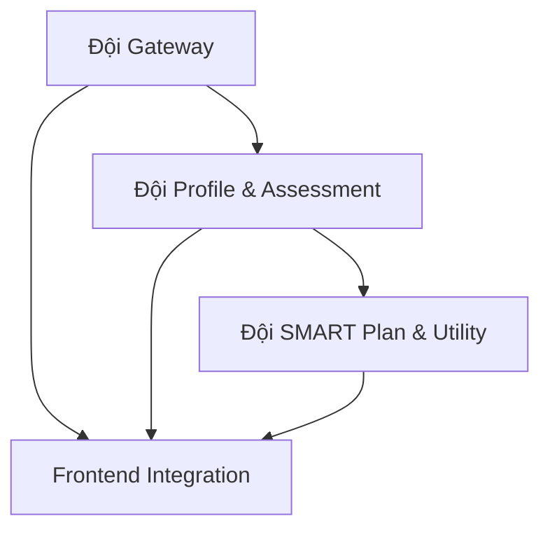

# Phân Chia Công Việc cho 6 Thành Viên (AI Coach Project)

Tôi sẽ phân chia nhóm thành **3 Đội cốt lõi**, mỗi đội chịu trách nhiệm cho một phần quan trọng của hệ thống.

## 1. Đội Kiến Trúc & Gateway (2 người)

Đội này tập trung vào việc thiết lập **hạ tầng cốt lõi** và **luồng giao tiếp ban đầu**.

### Thành viên

| Thành viên | Trách nhiệm chính | Chi tiết công việc (Focus tìm hiểu trước) |
|------------|-------------------|------------------------------------------|
| **Backend/Core Lead** (Người giỏi Java/Spring Boot) | Thiết lập Project và Cấu hình. Xây dựng API Gateway (Bước 1 & 4), đảm bảo kết nối Database, và triển khai Message Broker (Queue). | 1. **Setup Project** (Java/Spring Boot): Maven/Gradle, Database config. 2. **API Gateway** (Sync): Xử lý Authentication, Endpoint `/upload_cv` và `/set_goal`. 3. **Queue/Broker**: Tích hợp thư viện Queue (ví dụ: Spring Cloud Stream với RabbitMQ/Kafka/Redis). |
| **Frontend/Design Lead** (Người giỏi UI/UX & React/Vue/Thymeleaf) | Phát triển và Gắn API cho Giao diện người dùng. | 1. **Phân tích UI/UX**: Dùng v0.ai để tạo Mockup và cấu trúc các trang: Upload, Profile/Assessment (Unconfirmed), Goal Input, Action Plan Display. 2. **Gắn API** (Async): Xử lý trạng thái Loading/Polling/WebSocket cho các tác vụ Async (Bước 3, 5). |

## 2. Đội Xử lý Hồ sơ & Đánh giá (Profile & Assessment - 2 người)

Đội này chịu trách nhiệm cho **Lõi AI 1** (Bước 2, 3), nơi có độ phức tạp cao nhất về I/O và gọi API AI.

### Thành viên

| Thành viên | Trách nhiệm chính | Chi tiết công việc (Focus tìm hiểu trước) |
|------------|-------------------|------------------------------------------|
| **AI Processor 1** (CV I/O) | Extraction Text/Image từ CV. | 1. **Thư viện I/O**: Tìm hiểu và triển khai Apache PDFBox/Tika để trích xuất Raw Text từ PDF/DOCX. 2. **Service Listener** (Async): Viết Listener cho Event `CV_UPLOADED`, thực hiện trích xuất và chuẩn bị dữ liệu gửi cho AI. 3. **Xử lý File**: Đảm bảo File I/O và lưu trữ Avatar. |
| **AI Processor 2** (Gemini API Call) | Gọi API AI và Xử lý JSON Structured Output. | 1. **Tích hợp API**: Tìm hiểu Gemini Java SDK và cách cấu hình key. 2. **Prompt Engineering**: Xây dựng Prompt Tối ưu và định nghĩa JSON Schema cho Output kép (Profile & Assessment). 3. **Data Persistence**: Lưu Structured JSON vào DB và Publish Event `PROFILE_READY`. |

## 3. Đội Lập Kế hoạch & Phụ trợ (SMART Plan & Utility - 2 người)

Đội này chịu trách nhiệm cho **Lõi AI 2** (Bước 5) và các dịch vụ phụ trợ quan trọng (Bước 6).

### Thành viên

| Thành viên | Trách nhiệm chính | Chi tiết công việc (Focus tìm hiểu trước) |
|------------|-------------------|------------------------------------------|
| **AI Action Planner** | Tạo Kế hoạch Hành động SMART. | 1. **Service Listener** (Async): Viết Listener cho Event `GOAL_DEFINED`. 2. **Logic SMART**: Xây dựng Prompt và JSON Schema để Gemini tạo ra danh sách SMART Actions chi tiết. 3. **Business Logic**: Lấy dữ liệu Assessment cũ và Goal mới để gửi cho AI. Lưu Action Plan vào DB và Publish Event `PLAN_READY`. |
| **Utility/Testing** | Dịch vụ phụ trợ và Đảm bảo chất lượng. | 1. **Notification Service**: Viết Listener cho Event `PLAN_READY` để giả lập/thực hiện thông báo (Email/In-app). 2. **Testing**: Viết Unit Tests và Integration Tests cơ bản cho các luồng Core AI (đặc biệt là tính đúng đắn của JSON Output). 3. **Data Mocking**: Chuẩn bị sẵn dữ liệu mẫu cho CV và DB (rất quan trọng cho 12 tiếng). |

## Tổng quan Phân chia Công việc

### Workflow Dependencies

### Timeline & Priorities

#### Phase 1: Foundation (Tuần 1-2)
- **Đội Gateway**: Setup project, database, message broker
- **Đội Profile & Assessment**: Research và setup AI integration

#### Phase 2: Core Development (Tuần 3-4)
- **Đội Gateway**: API endpoints, authentication
- **Đội Profile & Assessment**: CV processing, Gemini integration
- **Đội SMART Plan**: Goal processing, action plan generation

#### Phase 3: Integration & Testing (Tuần 5-6)
- **Tất cả đội**: Integration testing, bug fixes
- **Đội Utility**: Comprehensive testing, data mocking

### Communication Protocol

- **Daily Standup**: Mỗi đội báo cáo progress và blockers
- **Cross-team Sync**: Họp 2 lần/tuần để đảm bảo integration
- **Shared Documentation**: Sử dụng README và API docs chung

### Success Metrics

- **Code Quality**: 80%+ test coverage
- **Performance**: Response time < 2s cho sync operations
- **Integration**: Tất cả events flow đúng sequence
- **User Experience**: Smooth UI với proper loading states