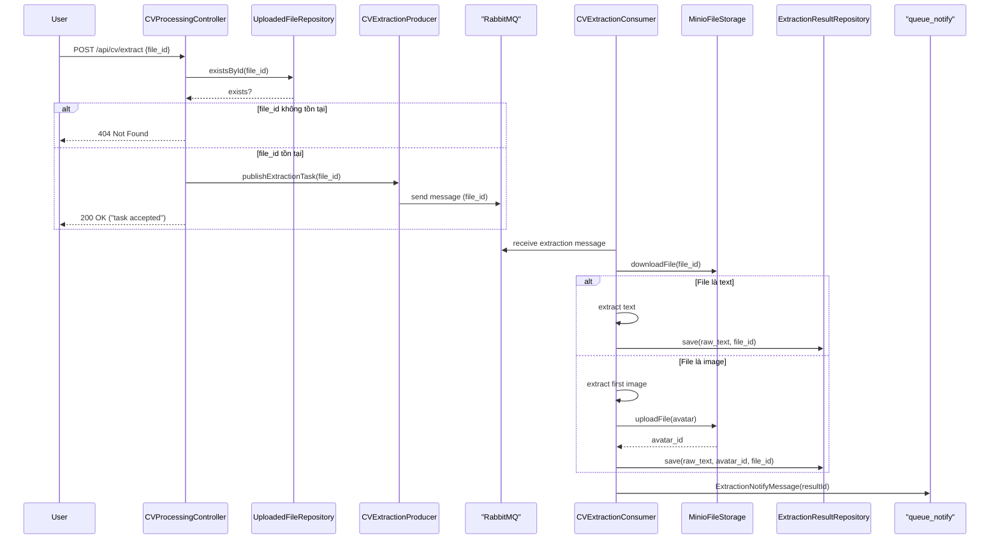

```mermaid
sequenceDiagram
    participant User
    participant CVProcessingController
    participant UploadedFileRepository
    participant CVExtractionProducer
    participant RabbitMQ as "RabbitMQ"
    participant CVExtractionConsumer
    participant MinioFileStorage
    participant ExtractionResultRepository
    participant queue_notify as "queue_notify"

    User->>CVProcessingController: POST /api/cv/extract {file_id}
    CVProcessingController->>UploadedFileRepository: existsById(file_id)
    UploadedFileRepository-->>CVProcessingController: exists?
    alt file_id không tồn tại
        CVProcessingController-->>User: 404 Not Found
    else file_id tồn tại
        CVProcessingController->>CVExtractionProducer: publishExtractionTask(file_id)
        CVExtractionProducer->>RabbitMQ: send message (file_id)
        CVProcessingController-->>User: 200 OK ("task accepted")
    end

    CVExtractionConsumer->>RabbitMQ: receive extraction message
    CVExtractionConsumer->>MinioFileStorage: downloadFile(file_id)
    alt File là text
        CVExtractionConsumer->>CVExtractionConsumer: extract text
        CVExtractionConsumer->>ExtractionResultRepository: save(raw_text, file_id)
    else File là image
        CVExtractionConsumer->>CVExtractionConsumer: extract first image
        CVExtractionConsumer->>MinioFileStorage: uploadFile(avatar)
        MinioFileStorage-->>CVExtractionConsumer: avatar_id
        CVExtractionConsumer->>ExtractionResultRepository: save(raw_text, avatar_id, file_id)
    end
    CVExtractionConsumer->>queue_notify: ExtractionNotifyMessage(resultId)
```
