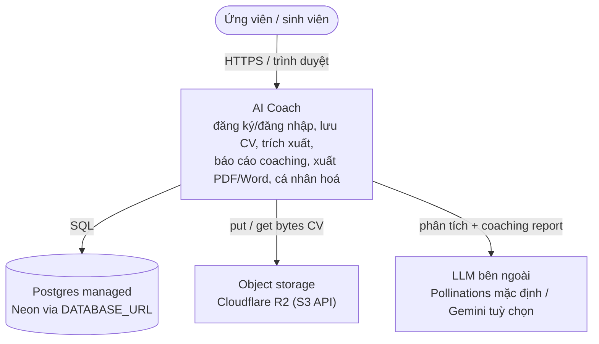
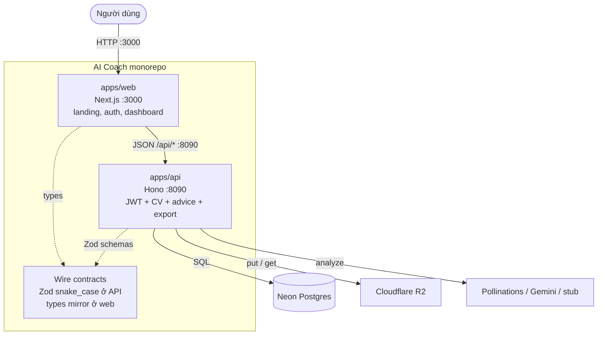
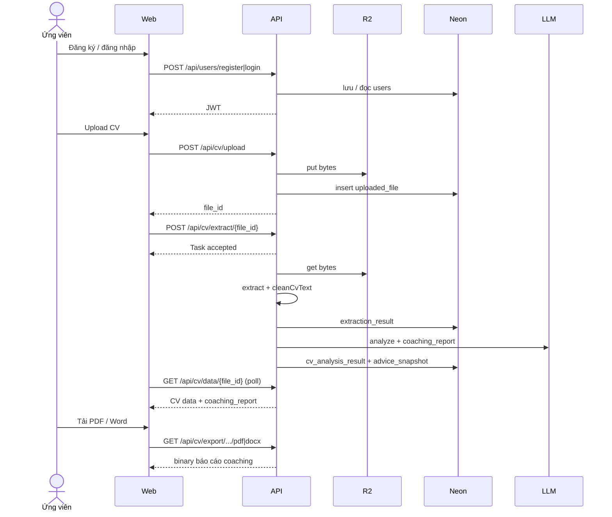

# C4 — AI Coach

Sơ đồ dưới dùng cú pháp **flowchart** của Mermaid (an toàn trên GitHub). Chúng map sang mức C4 **Context** (L1) và **Container** (L2). Không dùng block `C4Context` / `C4Container` vì bundle Mermaid trên GitHub thường không có plugin C4.

Chi tiết lớp bên trong API xem [logical.md](logical.md). Logic lõi / extract / coaching để thuyết trình: [core-logic.md](../core-logic.md), [extract-pipeline.md](../extract-pipeline.md), [coaching-personalization.md](../coaching-personalization.md). Credentials: [external-dependencies.md](../external-dependencies.md).

---

## Bối cảnh sản phẩm (trước khi nhìn hộp kỹ thuật)

AI Coach giúp ứng viên / sinh viên đưa CV lên, nhận lại phân tích có cấu trúc và một **báo cáo coaching** (nhận diện lĩnh vực / vị trí, góp ý format, nhận xét kinh nghiệm, khuyến nghị hành động), rồi tải báo cáo đó ra PDF hoặc Word.

Người dùng chỉ nói chuyện với sản phẩm qua trình duyệt. Hệ thống tự giữ identity, file CV, kết quả phân tích và lịch sử lời khuyên theo tài khoản. LLM là phụ trợ có thể thay (Pollinations mặc định, Gemini tuỳ chọn, stub offline). Database và object storage là bắt buộc khi boot API.

---

## Context (C4 L1)

| Actor / hệ thống     | Vai trò với sản phẩm                                                         |
| -------------------- | ---------------------------------------------------------------------------- |
| Ứng viên / sinh viên | Upload CV, xem kết quả, tải báo cáo, ghim lời khuyên, so sánh theo thời gian |
| AI Coach             | Sở hữu toàn bộ luồng nghiệp vụ và HTTP contract                              |
| Neon (Postgres)      | Persist user, metadata file, extraction, analysis, snapshot / pin            |
| Cloudflare R2        | Persist bytes CV gốc                                                         |
| LLM                  | Sinh structured fields + coaching report (có thể stub)                       |

Người dùng **không** nói chuyện trực tiếp với Neon, R2 hay LLM. Mọi truy cập đi qua AI Coach.

---

## Container (C4 L2)

Một process Node của API vừa phục vụ HTTP vừa chạy worker extract / analyze trong cùng process (queue in-process `setImmediate`). Không có consumer riêng, không có Redis / RabbitMQ trong demo này.

| Container | Path / package                                       | Trách nhiệm nghiệp vụ                                                          |
| --------- | ---------------------------------------------------- | ------------------------------------------------------------------------------ |
| Web       | `apps/web` (`@aicoach/web`)                          | UI: đăng ký / đăng nhập, upload, theo dõi xử lý, xem kết quả, advice, settings |
| API       | `apps/api` (`@aicoach/api`)                          | Auth JWT, upload / extract / data / export, advice snapshots & pins, health    |
| Wire      | `apps/api/src/contracts` + `apps/web/src/types/wire` | Hợp đồng JSON snake_case dùng chung giữa server và client                      |

---

## Ranh giới trách nhiệm

**Web làm gì**

- Giữ session JWT phía trình duyệt, gọi API, render dashboard.
- Không đọc Neon / R2 trực tiếp.
- Không chạy extract / LLM.

**API làm gì**

- Validate request, enforce ownership theo `user_id` / email JWT.
- Ghi metadata DB + bytes object storage.
- Enqueue extract, chạy worker, gắn `coaching_report`, tạo `advice_snapshot`.
- Stream binary PDF / DOCX của **báo cáo coaching** (không phải file CV gốc).

**Ngoài ranh giới demo**

- Không OCR ảnh scan (text kém → `hasEnoughText` fail).
- Không multi-tenant org / RBAC phức tạp.
- Không queue phân tán hay worker tách process.

---

## Luồng nghiệp vụ chính (mức container)

---

## Code bên trong container API

Xem [logical.md](logical.md): đường request `routes → handlers → service → repo`, platform adapters cho DB / storage / queue / JWT / LLM / extract / export. Module nằm dưới `apps/api/src/modules/{users,cv,advice,system}`.
