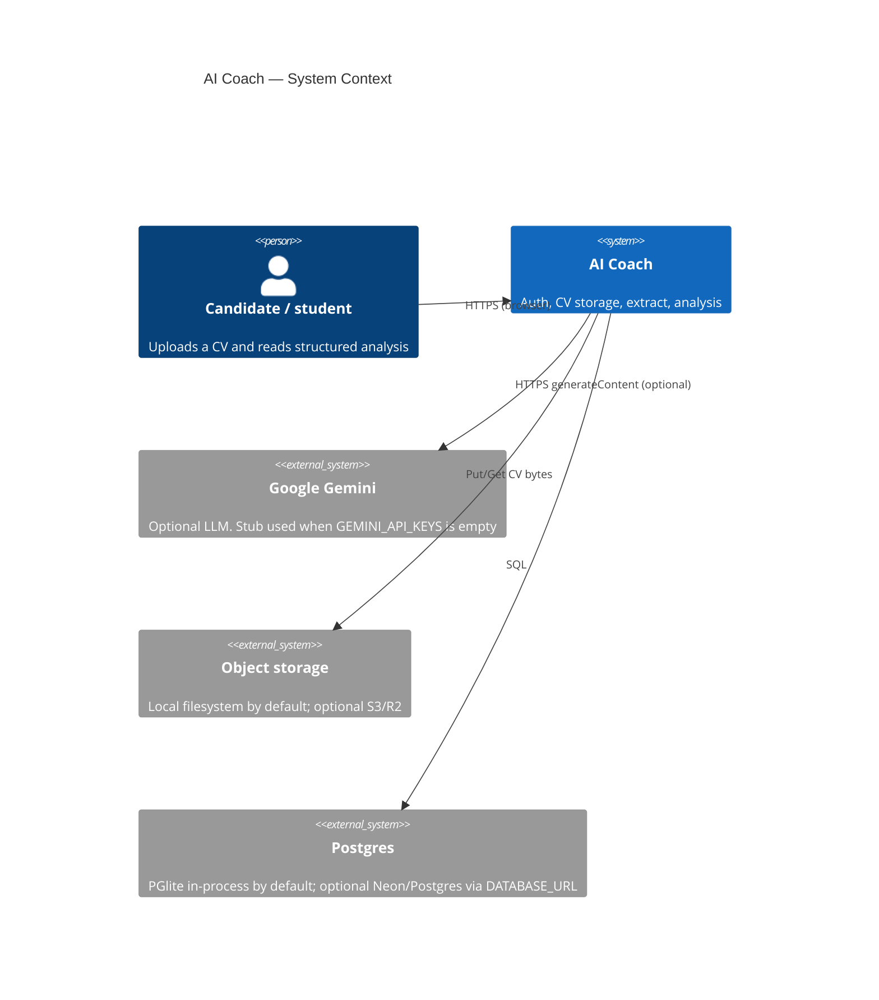
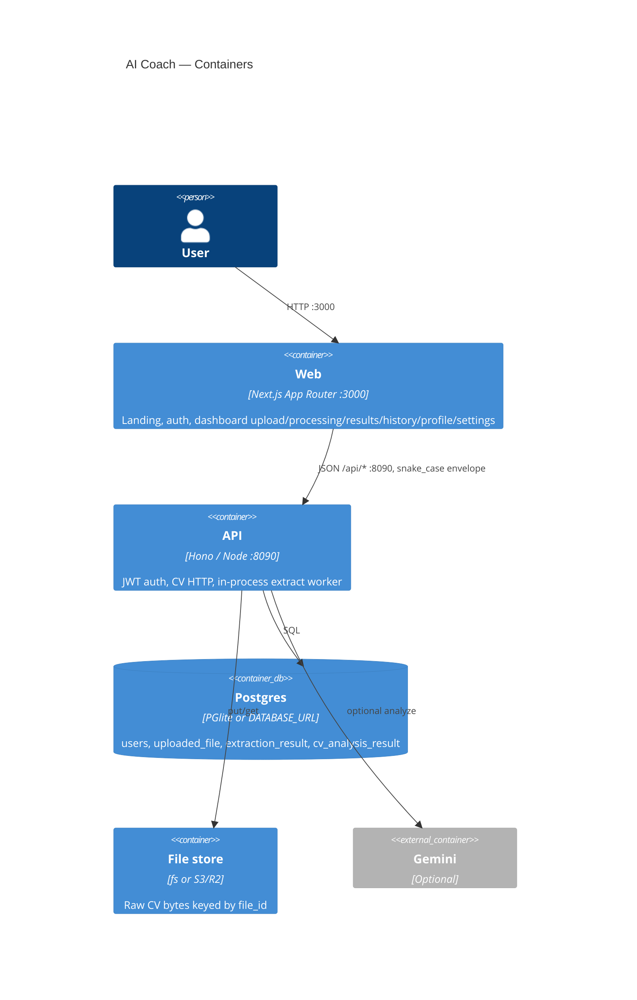

# C4 — AI Coach

## Context

Users talk only to AI Coach. The demo process owns the database, file bytes, and the extract/analyze pipeline. Gemini is a replaceable analysis backend, not a required runtime.

## Container

One Node API process does both HTTP and async extract (no separate consumer, no RabbitMQ). The Next app is a BFF-less SPA/RSC shell that calls the public HTTP contracts directly.

## Code (inside the API container)

See [logical.md](logical.md). Request path: `routes → handlers → service → repo`, with platform adapters for DB, storage, queue, JWT, and LLM.
