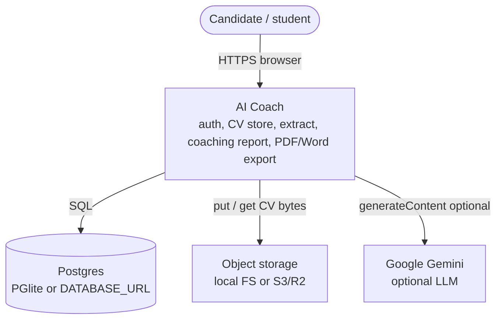
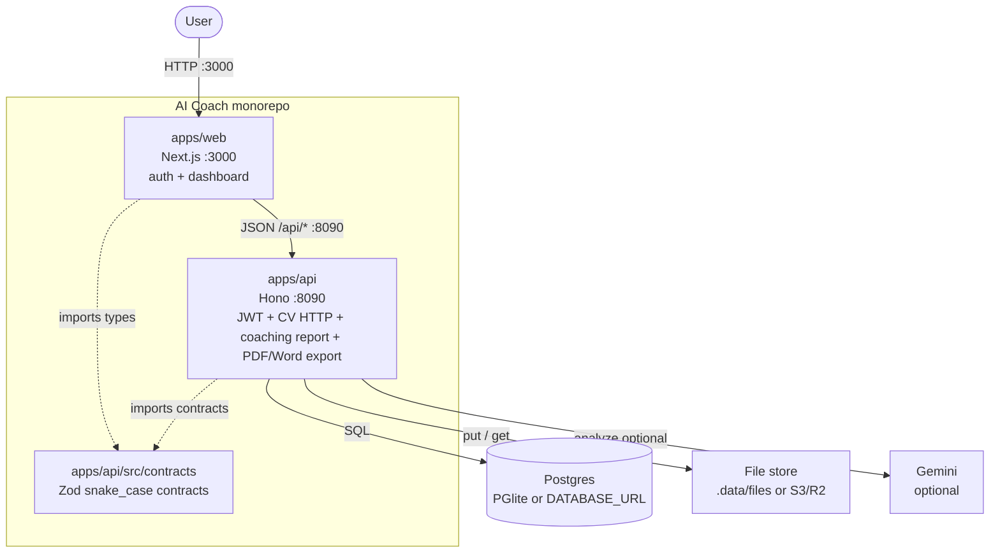

# C4 — AI Coach

Mermaid diagrams below use **flowchart** syntax (GitHub-safe). They map to C4 **Context** and **Container** levels. Avoid `C4Context` / `C4Container` blocks here — GitHub’s Mermaid bundle does not ship the C4 plugin reliably.

## Context (C4 L1)

Users talk only to AI Coach. The demo process owns the database, file bytes, and the extract/analyze pipeline. Gemini is a replaceable analysis backend, not a required runtime.

## Container (C4 L2)

One Node API process does both HTTP and async extract (no separate consumer, no RabbitMQ). The Next app calls the public HTTP contracts directly.

Monorepo mapping:

| Container | Path |
| --- | --- |
| Web | `apps/web` (`@aicoach/web`) |
| API | `apps/api` (`@aicoach/api`) |
| Wire contracts | `apps/api/src/contracts` + `apps/web/src/types/wire` |

## Code (inside the API container)

See [logical.md](logical.md). Request path: `routes → handlers → service → repo`, with platform adapters for DB, storage, queue, JWT, and LLM. Modules live under `apps/api/src/modules/{users,cv,system}`.
