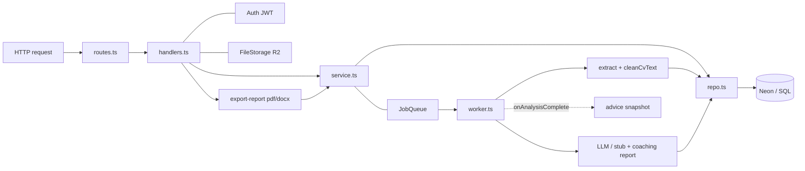
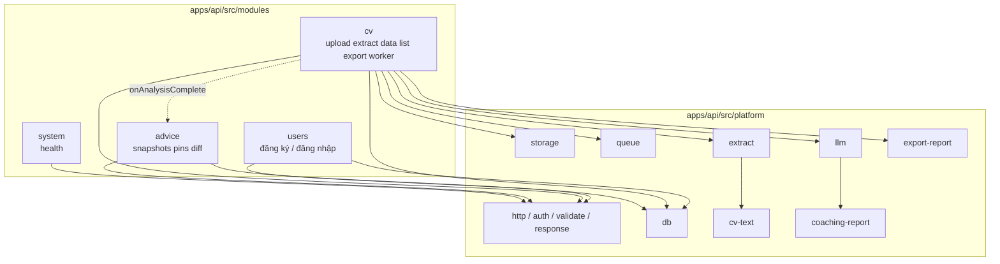
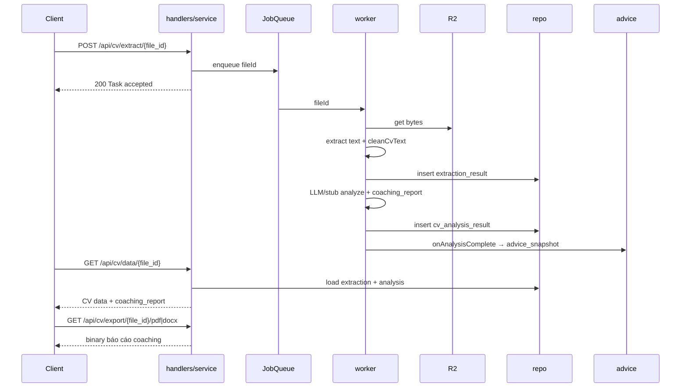

# Kiến trúc logic

Tài liệu mô tả cách code trong monorepo được chia lớp và module, gắn với luồng nghiệp vụ CV coaching. Cặp sơ đồ C4 mức hệ thống nằm ở [c4.md](c4.md). Bản thuyết trình logic lõi / extract / coaching: [core-logic.md](../core-logic.md), [extract-pipeline.md](../extract-pipeline.md), [coaching-personalization.md](../coaching-personalization.md).

## Gói trong monorepo

| Package        | Vai trò                                                |
| -------------- | ------------------------------------------------------ |
| `@aicoach/api` | HTTP + worker in-process + Zod contracts               |
| `@aicoach/web` | UI Next.js + TypeScript wire types (không Zod runtime) |

Không còn `packages/shared`. Hợp đồng wire sống ở API (`apps/api/src/contracts`); web mirror type ở `apps/web/src/types/wire.ts`.

---

## Lớp trong API



Quy ước trách nhiệm:

- **Routes** đăng ký path và gắn `auth.protect` khi cần. Không parse body nghiệp vụ.
- **Handlers** là chỗ duy nhất nhìn Hono `c`: validate, đọc `c.get('email')`, gọi đúng một method service, trả `ok()` / lỗi envelope.
- **Service** giữ luật nghiệp vụ (loại file, ownership, enqueue extract, dựng payload `GET /data`, export).
- **Repo** sở hữu SQL cho bảng của mình. Repo được dựng một lần trong `platform/composition.ts`.

Handlers không gọi SQL trực tiếp. Service không nhận Hono context. Repo không biết JWT.

---

## Module nghiệp vụ



| Module / platform | Việc nghiệp vụ                                                                  |
| ----------------- | ------------------------------------------------------------------------------- |
| `users`           | Tạo tài khoản, login, cấp JWT (subject = email)                                 |
| `cv`              | Upload CV, xếp hàng extract, đọc kết quả, list file, xuất PDF/Word báo cáo      |
| `advice`          | Timeline snapshot sau mỗi lần analyze, sổ tay pin, diff giữa hai snapshot       |
| `system`          | Health check                                                                    |
| `cv-text`         | `cleanCvText` / `hasEnoughText` (ý tưởng từ ATS; demo không OCR)                |
| `coaching-report` | Builder thuần: lĩnh vực, format, kinh nghiệm, khuyến nghị (mặc định tiếng Việt) |
| `export-report`   | Binary PDF (`pdf-lib`) và Word (`docx`) của báo cáo coaching, không phải CV gốc |
| `storage`         | Adapter S3/R2 bắt buộc lúc boot                                                 |
| `queue`           | `setImmediate` in-process; đủ cho demo single-node                              |

---

## Hợp đồng wire (JSON)

JSON dùng **snake_case**, giữ tương thích contract cũ kiểu Jackson `SNAKE_CASE`.

Envelope mọi response:

```json
{ "error_code": 0, "message": "OK", "data": {} }
```

Khi enqueue extract:

```json
{ "error_code": 0, "message": "Task accepted", "data": null }
```

Các field phân tích CV (`basic_info`, `education`, `work_experience`, `skills`, `certificates_languages`, `analysis_result`) là **object JSON**, không phải chuỗi đã stringify (tương đương legacy `@JsonRawValue`).

`coaching_report` (top-level trên `GET /api/cv/data/{file_id}` khi đã analyze xong):

```json
{
  "domain_inference": { "domain": "...", "job_titles": ["..."], "summary": "..." },
  "format_critique": { "summary": "...", "findings": ["..."] },
  "experience_comments": { "summary": "...", "strengths": ["..."], "gaps": ["..."] },
  "recommendations": ["..."]
}
```

Schema Zod: `apps/api/src/contracts/{auth,cv,advice,api}.ts`.

---

## Luồng async extract → coaching → cá nhân hoá



Các bước worker:

1. Đọc bytes từ R2 theo `storage_path`.
2. Trích text (`pdf-parse` / `mammoth`; PDF giả có thể fallback UTF-8; `.doc` best-effort).
3. Làm sạch bằng `cleanCvText`; nếu không đủ text thì đánh dấu chất lượng thấp / dừng analyze tùy path.
4. Insert `extraction_result`.
5. Gọi LLM (Pollinations / Gemini) hoặc stub; luôn gắn **coaching report**.
6. Insert `cv_analysis_result` (kèm `analysis_result.coaching_report`).
7. Hook `onAnalysisComplete` tạo `advice_snapshot` theo user + file + fingerprint.

`GET /api/cv/data/{file_id}` trả extraction-only khi mới extract xong; khi analysis sẵn sàng thì có thêm top-level `coaching_report`. Export endpoints stream báo cáo coaching dạng `application/pdf` hoặc Word OOXML.

---

## Authz và ownership

- Auth: Bearer JWT, subject = email.
- Upload / extract / data / list / export / advice đều cần token hợp lệ (trừ health và một số auth route).
- File gắn `uploaded_file.user_id`. Service từ chối đọc / extract / export file không thuộc user hiện tại.
- Advice snapshots / pins luôn scope theo account (email → user id).

---

## Bảng dữ liệu chính

| Bảng                 | Ý nghĩa nghiệp vụ                                      |
| -------------------- | ------------------------------------------------------ |
| `users`              | Tài khoản (email, password hash, display_name, locale) |
| `uploaded_file`      | Metadata CV + `storage_path` trên R2                   |
| `extraction_result`  | Text thô sau extract                                   |
| `cv_analysis_result` | Structured CV + `analysis_result` (có coaching report) |
| `advice_snapshot`    | Snapshot lời khuyên sau mỗi lần analyze thành công     |
| `advice_pin`         | Ghim thủ công trên dashboard Advice                    |

Schema bootstrap nằm trong `apps/api/src/platform/db.ts` (chạy khi mở DB).

---

## Web (ánh xạ màn hình → API)

| Màn hình            | Path UI                                     | API chính                                           |
| ------------------- | ------------------------------------------- | --------------------------------------------------- |
| Landing             | `/`                                         | —                                                   |
| Đăng ký / đăng nhập | `/auth/register`, `/auth/login`             | `POST /api/users/register`, `POST /api/users/login` |
| Upload              | `/dashboard/upload`                         | `POST /api/cv/upload`, `POST /api/cv/extract/{id}`  |
| Đang xử lý          | `/dashboard/processing`                     | poll `GET /api/cv/data/{id}`                        |
| Kết quả             | `/dashboard/results`                        | `GET /api/cv/data/{id}`, export pdf/docx            |
| Lịch sử             | `/dashboard/history`                        | `GET /api/cv/list`                                  |
| Advice              | `/dashboard/advice`                         | snapshots / diff / pins                             |
| Hồ sơ / settings    | `/dashboard/profile`, `/dashboard/settings` | user-facing settings UI                             |

Web không chứa quyết luật nghiệp vụ nặng. Ownership, enqueue, và dựng báo cáo nằm hết phía API.
