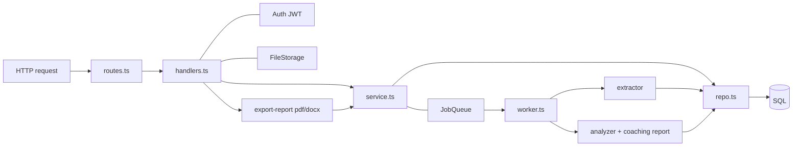
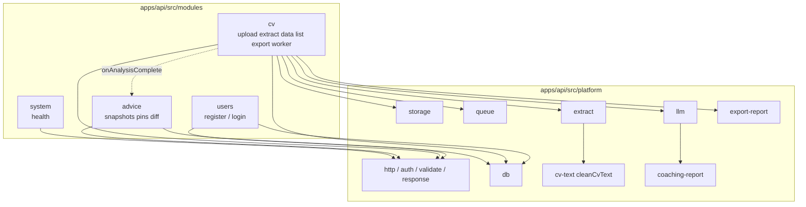
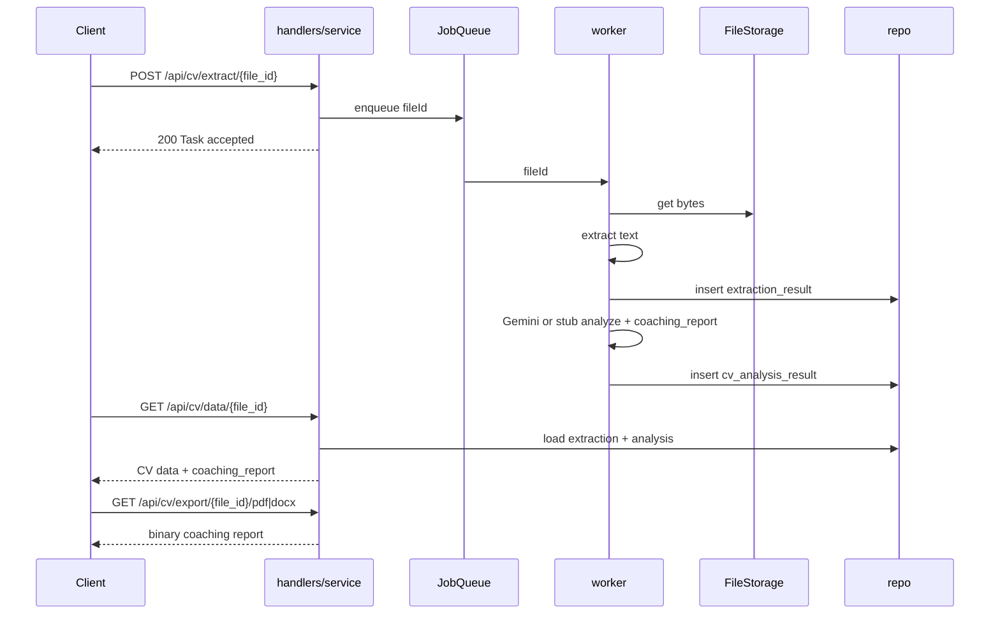

# Logical architecture

Monorepo packages:

| Package | Role |
| --- | --- |
| `@aicoach/shared` | Zod wire contracts both sides may import (`error_code` envelope, auth, CV) |
| `@aicoach/api` | HTTP + worker |
| `@aicoach/web` | UI surfaces |

## API layers



ASCII equivalent:

```
HTTP  →  routes.ts  →  handlers.ts  →  service.ts  →  repo.ts  →  SQL
                         |
                         +-- Auth JWT subject = email
                         +-- FileStorage local | S3
                         +-- JobQueue setImmediate
                         +-- export-report (PDF / DOCX of coaching report)
                                |
                                +-- worker.ts → extractor → analyzer(+coaching_report) → repo
```

- **Routes** register paths and attach `auth.protect` where needed. They do not parse bodies.
- **Handlers** are the only place that sees Hono `c`: validate, read `c.get('email')`, call one service method, return `ok()`.
- **Service** owns business rules (file type, ownership, enqueue extract).
- **Repo** owns SQL for its tables. Repos are constructed once in `platform/composition.ts`.

## Modules



- `users` — register / login
- `cv` — upload, extract, data, list, supported-types, **export pdf/docx**, worker
- `advice` — auto snapshots, manual pins, account-level diff
- `system` — health
- `cv-text` — ATS-inspired `cleanCvText` / `hasEnoughText` (no OCR in this demo)
- `coaching-report` — pure builder for domain / format / experience / recommendations (tiếng Việt)
- `export-report` — PDF + Word binaries of that report (not the original CV)

## Wire

JSON is snake_case, matching legacy Jackson `SNAKE_CASE`:

```json
{ "error_code": 0, "message": "Task accepted", "data": null }
```

CV analysis fields (`basic_info`, `education`, `work_experience`, `skills`, `certificates_languages`, `analysis_result`) are JSON objects, not quoted strings (legacy `@JsonRawValue`).

## Async extract



`POST /api/cv/extract/{file_id}` enqueues `{ fileId }` and returns immediately. The in-process worker:

1. Loads bytes from storage
2. Extracts text (`pdf-parse` / `mammoth`; fake PDFs fall back to UTF-8; `.doc` is best-effort)
3. Inserts `extraction_result`
4. Runs Gemini if `GEMINI_API_KEYS` is set, else a stub; always attaches a **coaching report** (domain inference, format critique, experience comments, recommendations)
5. Inserts `cv_analysis_result` (with `analysis_result.coaching_report`)

`GET /api/cv/data/{file_id}` returns extraction-only while analysis is still running (404 until extraction exists). When analysis is ready it also returns top-level `coaching_report`.

Export endpoints stream the **coaching report** as `application/pdf` or Word OOXML — not the original uploaded CV bytes.

## Authz

JWT Bearer, subject = email. Upload / extract / data / list require a valid token. Files are owned via `uploaded_file.user_id`.
