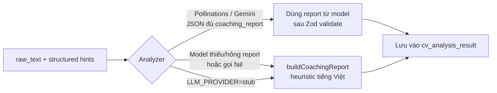
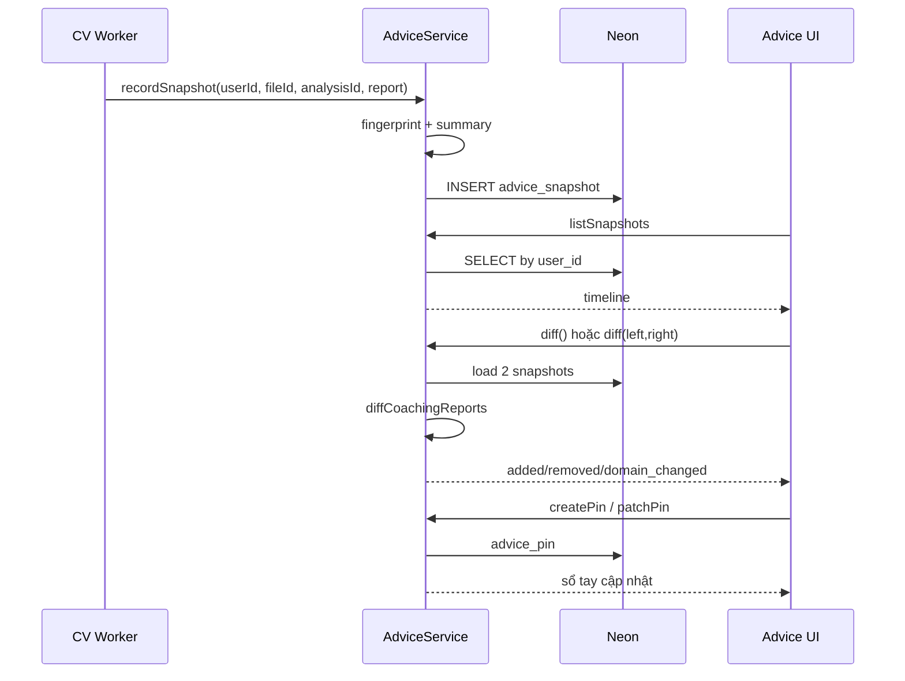

# Báo cáo coaching & cá nhân hoá

Phần **sản phẩm nổi bật** so với “parse CV thuần”: sau mỗi lần analyze, hệ thống tạo báo cáo cố vấn tiếng Việt, cho export, và giữ lịch sử theo tài khoản để so sánh / ghim.

Tổng quan: [core-logic.md](core-logic.md). Pipeline tạo ra analysis: [extract-pipeline.md](extract-pipeline.md).

---

## 1. Coaching report là gì?

Một object JSON cố định 4 mục (`CoachingReportWire`), luôn gắn kèm kết quả analyze:

| Mục | Ý nghĩa với ứng viên | Field chính |
| --- | --- | --- |
| `domain_inference` | “Mình đang nghiêng ngành / vị trí nào?” | `domain`, `job_titles[]`, `summary` |
| `format_critique` | “CV dễ đọc với ATS / nhà tuyển dụng chưa?” | `summary`, `findings[]` |
| `experience_comments` | “Kinh nghiệm mạnh / thiếu gì?” | `summary`, `strengths[]`, `gaps[]` |
| `recommendations` | “Làm gì tiếp theo?” (actionable) | `string[]` (tối đa ~6 khi heuristic) |

Nguyên tắc nội dung (prompt LLM + builder stub):

- Viết **tiếng Việt**, cụ thể, làm được ngay.
- Không bịa trải nghiệm không có trong CV.
- `job_titles` có thể giữ tên tiếng Anh phổ biến trên JD Việt Nam.

Wire top-level trên `GET /api/cv/data/{file_id}` → web render Results không phải đào sâu `analysis_result`.

---

## 2. Hai đường sinh báo cáo

### 2.1. Đường LLM

Prompt trong `platform/llm.ts` (`ANALYSIS_PROMPT_HEADER`) yêu cầu model trả **cùng schema** structured CV + `coaching_report`. Sau parse Zod, nếu `coaching_report` invalid → chuyển sang heuristic với hints đã parse được (không bỏ toàn bộ analysis).

### 2.2. Đường heuristic (`platform/coaching-report.ts`)

`buildCoachingReport(rawText, hints)` — deterministic, không gọi mạng:

**Domain**

- Keyword regex theo nhóm: Kỹ thuật phần mềm, Dữ liệu / Phân tích, Sản phẩm / Thiết kế, Vận hành / Kinh doanh.
- Không khớp → lấy position từ work experience đầu tiên, hoặc “Chuyên môn tổng quát”.

**Format**

- CV quá ngắn (< 8 dòng), thiếu email/phone, thiếu heading mục, quá dài (> 6000 ký tự), yếu mốc năm → đẩy vào `findings`.
- Không có issue → một finding “đã đọc được, nên polish”.

**Kinh nghiệm**

- Đếm role / skill có cấu trúc.
- Tìm ngôn ngữ impact (`led`, `tăng`, `%`, …).
- Sinh `strengths` / `gaps` tương ứng.

**Recommendations**

- Ghép domain + finding format đầu + gap kinh nghiệm đầu thành checklist ngắn (≤ 6 ý).
- Luôn gợi ý xuất báo cáo rồi chỉnh theo checklist trước khi nộp hồ sơ.

**Vì sao cần heuristic?** Demo môn học không phụ thuộc 100% LLM free tier. Stub vẫn cho thầy cô thấy đủ 4 mục coaching.

---

## 3. Export PDF / Word

Người dùng tải **báo cáo coaching**, không phải file CV gốc.

| Format | Thư viện | Content-Type |
| --- | --- | --- |
| PDF | `pdf-lib` | `application/pdf` |
| Word | `docx` | OOXML Word |

API: `GET /api/cv/export/{file_id}/pdf|docx` (JWT + ownership).

Exporter nhận `report` + tên ứng viên (từ `basic_info`) + tên file gốc để đặt `{stem}-coaching-report.*`. PDF xử lý font / WinAnsi để tiếng Việt không vỡ khi mở bằng viewer phổ biến.

---

## 4. Cá nhân hoá theo account

### 4.1. Snapshot tự động

Sau `INSERT cv_analysis_result`, worker gọi `onAnalysisComplete` → `AdviceService.recordSnapshot`:

| Field snapshot | Nguồn |
| --- | --- |
| `user_id`, `file_id`, `analysis_id` | Hook worker |
| `domain` | `report.domain_inference.domain` |
| `summary` | `"{domain}: {recommendation đầu hoặc format summary}"` (≤ 240 ký tự) |
| `report` | Toàn bộ `CoachingReportWire` (JSONB) |
| `fingerprint` | SHA-256 rút 32 hex của các section đã normalize NFC |

Fingerprint dùng để so nhanh “báo cáo lần này có khác lần trước về mặt nội dung cốt” (không phải hash file CV).

Lỗi ghi snapshot **không** làm fail analysis (chỉ warn).

### 4.2. Timeline

`GET /api/advice/snapshots` — list theo `user_id`, mới nhất trước, có phân trang `before`.

Mỗi item đủ để UI vẽ timeline: domain, summary, file_name, thời điểm, fingerprint.

### 4.3. Diff hai snapshot

`GET /api/advice/diff`:

- Có `left_id` & `right_id` → so đúng cặp (vẫn check ownership).
- Không truyền → lấy **2 snapshot mới nhất**; cần ≥ 2 lần analyze trong account.
- Tự đảo để **left = cũ hơn**, right = mới hơn (UX ổn định).

`diffCoachingReports` (`modules/advice/diff.ts`) so từng tập chuỗi (normalize NFC, collapse space):

| Nhóm thay đổi | Ý nghĩa |
| --- | --- |
| `domain_changed` (+ from/to) | Đổi hướng lĩnh vực |
| `recommendations.added/removed/unchanged` | Checklist việc làm thay đổi |
| `format_findings.added/removed` | Góp ý format mới / hết |
| `experience.strengths_*` / `gaps_*` | Nhận xét kinh nghiệm dịch chuyển |

Đây là diff **nội dung lời khuyên**, không phải diff text CV từng dòng.

### 4.4. Pin (sổ tay)

User tự ghim một ý từ báo cáo (hoặc tự viết) để theo dõi:

| Field | Ý nghĩa |
| --- | --- |
| `section` | Thuộc nhóm coaching nào (domain / format / experience / recommendations, …) |
| `body` | Nội dung ghim |
| `status` | Trạng thái theo dõi (open / done / … theo contract) |
| `source_snapshot_id` | (optional) lấy từ snapshot nào |
| `file_id` | (optional) gắn file CV |

API: `GET/POST/PATCH/DELETE /api/advice/pins`.

---

## 5. Luồng dữ liệu cá nhân hoá

---

## 6. Giá trị thuyết trình

1. **Coaching là first-class product object**, không phải chuỗi markdown tùy hứng — có schema Zod, có UI, có export.
2. **LLM và heuristic cùng contract** → demo không gãy khi hết quota.
3. **Cá nhân hoá account-level**: mỗi lần analyze để lại dấu vết; diff cho thấy tiến triển lời khuyên.
4. **Pin** biến recommendation thành việc theo dõi, gần với “coaching notebook”.
5. Tách rõ: Results = lần analyze của **một file**; Advice = **theo thời gian trên cả account**.

---

## 7. Map câu hỏi → code

| Câu hỏi | Chỗ nhìn |
| --- | --- |
| 4 mục report sinh thế nào (stub)? | `platform/coaching-report.ts` |
| Prompt LLM yêu cầu gì? | `ANALYSIS_PROMPT_HEADER` trong `platform/llm.ts` |
| Fallback khi model thiếu report? | `analysisFromLlmJson` |
| Snapshot tạo lúc nào? | `worker.ts` → `onAnalysisComplete` → `AdviceService.recordSnapshot` |
| Fingerprint gồm field nào? | `fingerprintReport` trong `modules/advice/service.ts` |
| Diff tính sao? | `modules/advice/diff.ts` |
| Export lấy gì? | `CvService.exportReport` + `platform/export-report.ts` |
