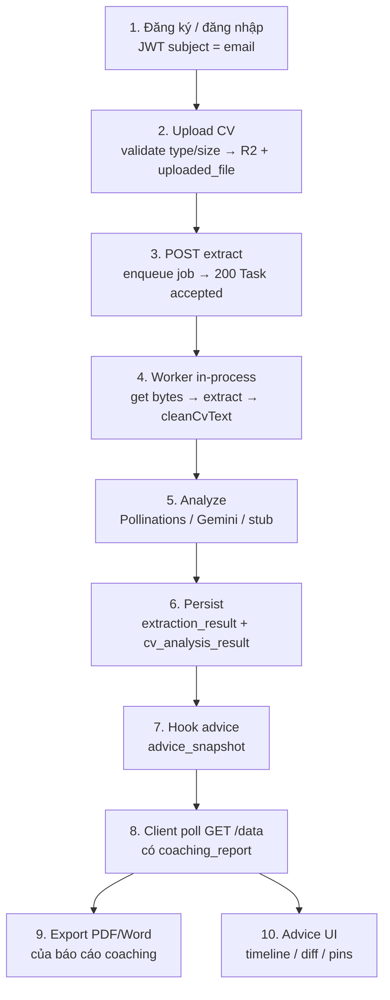

# Logic lõi hệ thống (dùng để thuyết trình)

Tài liệu này tóm tắt **ý tưởng thiết kế + luồng nghiệp vụ chính** của AI Coach. Mục tiêu: trình bày trước thầy cô mà không cần mở từng file TypeScript.

Đọc kèm khi cần đào sâu:

- [extract-pipeline.md](extract-pipeline.md) — trích text, làm sạch, analyze
- [coaching-personalization.md](coaching-personalization.md) — báo cáo coaching + snapshot / diff / pin
- [architecture/c4.md](architecture/c4.md) · [architecture/logical.md](architecture/logical.md)

---

## 1. Bài toán sản phẩm (nói trong 30 giây)

Ứng viên upload CV → hệ thống **không chỉ parse field**, mà còn trả một **báo cáo coaching** bằng tiếng Việt (lĩnh vực, góp ý format, nhận xét kinh nghiệm, khuyến nghị), cho phép **tải PDF/Word** và **theo dõi tiến triển theo tài khoản** qua snapshot / diff.

Điểm khác ATS tuyển dụng: trọng tâm là **cố vấn cá nhân**, không phải ranking ứng viên hàng loạt.

---

## 2. Ba trụ cột logic

| Trụ | Việc hệ thống làm | Kết quả người dùng thấy |
| --- | --- | --- |
| **Pipeline CV** | Upload → lưu R2 → xếp hàng extract → text sạch → LLM/stub → DB | Màn Results + History |
| **Coaching report** | Từ text + structured fields → 4 mục coaching; export PDF/Word | Báo cáo đọc được / gửi mentor |
| **Cá nhân hoá** | Mỗi lần analyze xong → snapshot; pin thủ công; diff hai lần | Màn Advice |

Cả ba đều chạy trong **một process API** (Hono Node). Không có worker máy riêng, không Redis.

---

## 3. Luồng nghiệp vụ end-to-end (slide chính)



### Vì sao extract lại async?

- HTTP trả ngay `Task accepted` để UI không bị treo khi PDF lớn hoặc LLM chậm.
- Worker chạy bằng `setImmediate` **sau** khi response đã gửi (queue in-process).
- Web poll `GET /api/cv/data/{file_id}` đến khi có `coaching_report`.

Đây là pattern **async job tối giản** đủ cho demo single-node; dễ giải thích trong ASE mà chưa cần message broker.

---

## 4. Tách lớp trong API (điểm kiến trúc)

```text
HTTP → routes → handlers → service → repo → SQL (Neon)
                      │
                      ├─ Auth JWT
                      ├─ FileStorage (R2)
                      ├─ JobQueue (setImmediate)
                      └─ worker → extract + LLM + coaching + advice hook
```

| Lớp | Được làm | Không được làm |
| --- | --- | --- |
| Routes | Map URL, gắn `auth.protect` | Parse body nghiệp vụ |
| Handlers | Validate, đọc email JWT, gọi 1 service method, trả envelope | Viết SQL |
| Service | Luật nghiệp vụ: ownership, loại file, enqueue, dựng payload, export | Nhìn Hono `c` |
| Repo | SQL của bảng mình | Biết JWT / HTTP |

**Composition root** (`platform/composition.ts` + `index.ts`) dựng repo / storage / queue / analyzer **một lần lúc boot**. Module không tự `new` repo của module khác.

---

## 5. Ownership & bảo mật (nhanh)

1. Login → JWT Bearer, subject = email.
2. Mọi thao tác CV / advice lấy user từ email → `user_id`.
3. File gắn `uploaded_file.user_id`; service từ chối đọc / extract / export file người khác.
4. Snapshot / pin cũng scope theo `user_id`.
5. Boot **fail-fast** nếu thiếu `DATABASE_URL` hoặc `S3_*` — không chạy “nửa local nửa cloud” dễ lệch demo.

---

## 6. Dữ liệu cốt lõi (nhớ 6 bảng)

| Bảng | Sinh ra khi | Chứa gì |
| --- | --- | --- |
| `users` | Đăng ký | email, password hash (scrypt), display_name |
| `uploaded_file` | Upload | metadata + `storage_path` trên R2 |
| `extraction_result` | Worker extract xong | `raw_text` đã clean |
| `cv_analysis_result` | Worker analyze xong | structured fields + `analysis_result` (có coaching) |
| `advice_snapshot` | Hook sau analyze | copy coaching report + fingerprint |
| `advice_pin` | User ghim tay | section + body + status |

Quan hệ nghiệp vụ: **1 file → nhiều lần extract/analyze theo thời gian** (mỗi lần job chạy insert bản ghi mới); snapshot gắn `analysis_id` để timeline Advice có nguồn.

---

## 7. Hợp đồng HTTP (envelope thống nhất)

Mọi JSON response:

```json
{ "error_code": 0, "message": "OK", "data": {} }
```

- Thành công extract enqueue: `message = "Task accepted"`, `data = null`.
- Wire **snake_case** (giữ tương thích contract cũ).
- Schema Zod ở `apps/api/src/contracts`; web chỉ mirror type.

---

## 8. Điểm “nói nổi” trước thầy cô

1. **Sản phẩm rõ**: coaching report + export + cá nhân hoá, không dừng ở parse CV.
2. **Kiến trúc sạch**: routes / handlers / service / repo; platform adapters tách DB, R2, LLM, queue.
3. **Async tối giản có chủ đích**: in-process queue + poll — đủ demo, dễ hiểu trade-off.
4. **Chất lượng text**: `cleanCvText` (ý tưởng ATS) trước LLM; đánh dấu `extract_quality`.
5. **LLM thay được**: Pollinations (default, không key) / Gemini / stub heuristic cùng một schema Zod.
6. **Fallback an toàn**: LLM lỗi hoặc thiếu `coaching_report` → `buildCoachingReport` heuristic tiếng Việt.
7. **Cá nhân hoá account-level**: snapshot tự động, fingerprint, diff added/removed, pin sổ tay.
8. **Infra thật**: Neon + R2 bắt buộc lúc boot — gần production hơn là demo chỉ PGlite/disk.

---

## 9. Map “slide → file code” (khi bị hỏi sâu)

| Câu hỏi thầy cô | File trả lời |
| --- | --- |
| Upload validate thế nào? | `modules/cv/service.ts` → `upload` |
| Job chạy ra sao? | `platform/queue.ts` + `modules/cv/worker.ts` |
| PDF/DOCX lấy text ra sao? | `platform/extract.ts` |
| Làm sạch text? | `platform/cv-text.ts` |
| Prompt / stub / Gemini? | `platform/llm.ts` |
| Heuristic coaching? | `platform/coaching-report.ts` |
| Snapshot / diff / pin? | `modules/advice/service.ts`, `diff.ts` |
| PDF/Word export? | `platform/export-report.ts` |
| Schema DB? | `platform/db.ts` |
