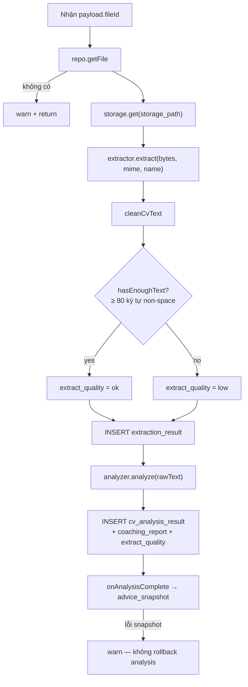
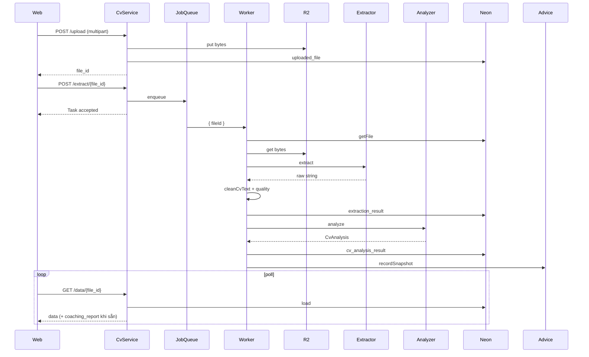

# Pipeline extract & analyze

Tài liệu đào sâu **nhánh kỹ thuật trung tâm**: từ bytes CV trên R2 đến structured fields + coaching report trong Neon. Dùng khi thuyết trình phần “hệ thống xử lý CV thế nào”.

Tổng quan sản phẩm: [core-logic.md](core-logic.md).

---

## 1. Vi trí trong luồng lớn

```text
Upload (sync)     →  R2 put + INSERT uploaded_file  →  trả file_id
Extract (async)   →  queue  →  worker  →  text + analysis  →  DB
Read (sync poll)  →  GET /api/cv/data/{file_id}
```

| Bước | Sync/Async | API | Kết thúc khi |
| --- | --- | --- | --- |
| Upload | Sync | `POST /api/cv/upload` | Có `file_id`, file nằm trên R2 |
| Extract enqueue | Sync (nhẹ) | `POST /api/cv/extract/{file_id}` | Job vào queue, HTTP `Task accepted` |
| Worker | Async | (không HTTP) | Có `extraction_result` + `cv_analysis_result` (+ snapshot) |
| Đọc kết quả | Sync | `GET /api/cv/data/{file_id}` | Client thấy `coaching_report` |

UI Processing chỉ **poll** GET data; không mở WebSocket.

---

## 2. Upload (cổng vào pipeline)

`CvService.upload` (`modules/cv/service.ts`):

1. Chuẩn hoá tên file (`basename`).
2. Từ chối file rỗng.
3. Giới hạn **10MB**.
4. Chỉ nhận PDF / DOCX / DOC (extension hoặc MIME allow-list).
5. Map email JWT → `users.id` (không có user → forbidden).
6. `storage_path = {fileId}/{fileName}` → `storage.put` (R2).
7. INSERT `uploaded_file` (metadata + path, chưa có text).

**Ý thiết kế:** tách **lưu trữ bytes** và **phân tích**. Upload nhanh, ổn định; analyze có thể chậm / fail mà không mất file gốc.

---

## 3. Enqueue extract

`CvService.extract`:

1. `requireOwnedFile` — file phải tồn tại và thuộc user (trừ edge không có `user_id`).
2. `queue.enqueue('cv.extract', { fileId })`.
3. Return ngay (handler bọc `Task accepted`).

Queue (`platform/queue.ts`):

```text
enqueue → setImmediate(() => handler(payload))
```

- Chạy sau tick hiện tại → response HTTP kịp flush.
- Lỗi job chỉ `console.error`; không crash process.
- Demo single-node: đủ. Trade-off cần nói: restart process giữa chừng có thể mất job chưa chạy; production sẽ cần queue bền (SQS / Cloudflare Queues / …).

---

## 4. Worker — 7 bước trong một job

Code: `modules/cv/worker.ts` → `registerCvWorker`.



### 4.1. Lấy bytes

Đọc từ R2 theo `storage_path` đã lưu lúc upload. Worker **không** nhận lại multipart từ client.

### 4.2. Extract theo định dạng (`platform/extract.ts`)

| Định dạng | Thư viện / cách | Ghi chú |
| --- | --- | --- |
| PDF | `pdf-parse` | Fail hoặc rỗng → nếu buffer trông như text UTF-8 thì fallback (phục vụ test fake PDF) |
| DOCX | `mammoth.extractRawText` | Ổn định nhất trong demo |
| DOC | mammoth best-effort | Không parse được → thông báo nên dùng PDF/DOCX |
| Khác | Nếu looksLikeText | Đọc UTF-8; không thì chuỗi rỗng |

**Không có OCR.** CV scan ảnh → text ngắn → `extract_quality = low` nhưng pipeline vẫn chạy (stub/LLM vẫn được gọi với text ít).

### 4.3. Làm sạch text (`platform/cv-text.ts`)

`cleanCvText` lấy cảm hứng từ parser ATS (AhaMove ATS):

- Normalize Unicode **NFC** (giữ dấu tiếng Việt).
- Bỏ Private Use Area / glyph lỗi PDF, control chars.
- Gỡ bullet trang trí đầu dòng.
- Xoá dòng “Page N / Trang N”, dòng chỉ toàn số trang.
- Collapse khoảng trắng / dòng trống thừa.

`hasEnoughText`: sau clean, đếm ký tự không phải whitespace ≥ **80** → `ok`, ngược lại `low`.

Cờ `extract_quality` được ghi vào `analysis_result` để UI / debug biết tín hiệu extract yếu.

### 4.4. Analyze (`platform/llm.ts`)

Cùng một interface:

```ts
interface Analyzer {
  name: string;
  analyze(rawText: string): Promise<CvAnalysis>;
}
```

`CvAnalysis` gồm:

- `basic_info`, `education`, `work_experience`, `skills`, `certificates_languages`
- `coaching_report` (4 section — xem [coaching-personalization.md](coaching-personalization.md))

Chọn provider lúc boot (`createAnalyzer` từ config):

| Provider | Khi nào | Hành vi |
| --- | --- | --- |
| `pollinations` | Default | HTTP OpenAI-compatible, **không API key** |
| `gemini` | `LLM_PROVIDER=gemini` + keys | `gemini-2.0-flash`, xoay nhiều key nếu fail |
| `stub` | `LLM_PROVIDER=stub` hoặc LLM fail | Heuristic regex + `buildCoachingReport` |

Prompt chung (`ANALYSIS_PROMPT_HEADER`):

- Vai trò: coach nghề nghiệp tại Việt Nam.
- Output: **đúng một JSON**, không markdown.
- Summary / findings / recommendations bằng **tiếng Việt**, cụ thể, actionable.
- Không bịa kinh nghiệm không có trong CV.
- Truncate CV ở **24_000** ký tự trước khi gửi model.

Sau khi model trả:

1. Gỡ fence \`\`\`json nếu có.
2. `decodeUnicodeEscapesDeep` (model đôi khi để `\uXXXX` literal).
3. Parse bằng Zod (`geminiCvResponseSchema` + các schema field).
4. Thiếu / hỏng `coaching_report` → **fallback** `buildCoachingReport(rawText, hints)`.
5. Gemini/Pollinations lỗi hết → trả `stubAnalyze` (không để worker chết im).

### 4.5. Persist analysis

INSERT `cv_analysis_result`:

- Các cột structured (`basic_info`, …) dạng JSONB.
- `analysis_result` JSONB = toàn bộ analysis + `coaching_report` + `extract_quality`.

### 4.6. Hook advice

Nếu có `onAnalysisComplete` (wire lúc build app): tạo `advice_snapshot`. Lỗi snapshot chỉ warn — **không** xoá analysis đã lưu (phân tích CV vẫn xem được).

---

## 5. Đọc kết quả (`GET /data`)

`CvService.getData`:

1. Ownership check.
2. Bắt buộc có `extraction_result` — chưa có → 404 (client tiếp tục poll).
3. `analysis` có thể null → trả extraction-only (raw_text, chưa có coaching).
4. Có analysis → parse Zod từng field + `pickCoachingReport` (đọc nested hoặc rebuild heuristic nếu dữ liệu cũ lệch shape).
5. Top-level `coaching_report` để web render nhanh không phải đào `analysis_result`.

---

## 6. Export (sau khi pipeline xong)

`exportReport`:

- Cần đủ extraction + analysis.
- Lấy `coaching_report` (không lấy bytes CV gốc).
- PDF: `pdf-lib` (lưu ý WinAnsi / font cho tiếng Việt đã xử lý trong exporter).
- DOCX: thư viện `docx`.
- Tên file: `{stem}-coaching-report.pdf|docx`.

---

## 7. Sơ đồ sequence đầy đủ



---

## 8. Trade-off & giới hạn (nên nói thật)

| Chủ đề | Lựa chọn demo | Hệ quả |
| --- | --- | --- |
| Queue | In-process `setImmediate` | Đơn giản; mất job nếu kill process giữa chừng |
| OCR | Không | CV ảnh scan kém chất lượng |
| DOC legacy | Best-effort | Khuyến nghị PDF/DOCX |
| LLM free | Pollinations | Có thể 429 / chậm; stub vẫn cứu demo |
| Text ngắn | Vẫn analyze | `extract_quality=low` báo tín hiệu yếu |
| Snapshot fail | Không rollback analysis | User vẫn xem được Results |

---

## 9. Checklist demo sống trên slide

1. Login account thử nghiệm.
2. Upload một PDF/DOCX có text chọn được.
3. Processing → Results: bốn mục coaching tiếng Việt.
4. (Tuỳ chọn) Tắt mạng LLM / `LLM_PROVIDER=stub` → vẫn có báo cáo heuristic.
5. Export PDF mở được dấu tiếng Việt.
6. Upload lần hai / analyze lại → Advice có thêm snapshot.
